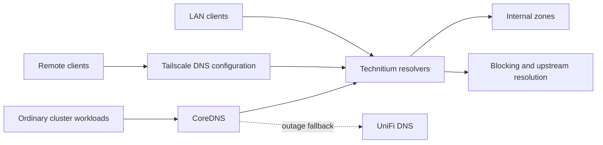

# Networking

This document describes component responsibilities and constraints for network
changes. Addresses and deployed settings belong in their existing configuration
sources. Keep live inventories, access rules, and operational audits outside the
repository.

## Responsibilities

| Component | Responsibility |
| --- | --- |
| UniFi | LAN routing, VLANs, DHCP, and firewall policy between routed networks |
| Tailscale | Authenticated remote connectivity and access policy for tailnet traffic |
| Cilium | Kubernetes Pod and Service networking, load-balancer address announcements, and workload policy |
| Envoy Gateway | Application ingress and route-specific access controls |
| Technitium | Internal DNS zones, recursive resolution, and DNS blocking |
| CoreDNS | Kubernetes service discovery and forwarding external queries |
| DNSControl | Desired public records and separate internal DNS views |

These controls apply at different points. A VLAN creates a separate Layer 2
network; firewall rules determine which routed connections can cross its boundary.
Traffic within a VLAN can bypass the gateway. Use host firewalls or supported
switch/AP isolation when that traffic also needs restrictions. See
[UniFi's isolation layers](https://help.ui.com/hc/en-us/articles/18965560820247-Implementing-Network-and-Client-Isolation-in-UniFi).

## Application and remote access

Cilium uses native dual-stack routing and advertises Service addresses onto the
LAN. Envoy routes application requests to their backends. Gateway authorization
does not protect direct access to backend Pod addresses; workload policy is a
separate control. IPv4 and IPv6 routes, source addresses, and return paths must be
considered together. See [Talos networking](kubernetes/talos/README.md).

Prefer direct Tailscale connections to enrolled hosts. Advertise narrow host or
service routes for destinations without a client. Route approval establishes
reachability; tailnet grants establish permission. Subnet routers normally
translate source addresses, so downstream rules may see the router rather than
the original client. Check the observed source before writing allowlists. See
[Tailscale subnet routers](https://tailscale.com/docs/features/subnet-routers).

Ordinary SSH can run over Tailscale with the destination's existing SSH server
and authentication. Tailscale SSH is a separate authentication option. Neither
tailnet policy nor VLAN placement replaces restrictions on a host's LAN-facing
services. See [SSH over Tailscale](https://tailscale.com/docs/reference/ssh-over-tailscale).

## DNS and filtering

Technitium runs in Kubernetes and independently on the NAS. Catalog replication
distributes internal zones. DNSControl also maintains an independent internal
record view on UniFi. Zone replication and blocking configuration are distinct;
verify both resolvers enforce the intended filtering. See
[CoreDNS](kubernetes/cluster/coredns/README.md) and
[DNSControl](infrastructure/dns/README.md).

CoreDNS tries the configured upstreams sequentially, falling back on connection
failure, `SERVFAIL`, or `REFUSED`. Negative answers do not trigger fallback.
UniFi's independent record view provides availability; matching internal records
does not imply matching blocklists. Keep Talos bootstrap DNS independent of
workloads running on that node.

Clients should use resolvers with equivalent filtering when filtering must be
preserved. Do not rely on DHCP or Tailscale resolver order as strict failover.
For remote filtering, use reachable filtered global nameservers; split DNS for
internal domains alone leaves other queries to other resolvers. See
[Tailscale DNS behavior](https://tailscale.com/docs/reference/dns-in-tailscale).

Allow DNS over both UDP and TCP. Account for workloads with explicit DNS settings
and infrastructure that intentionally queries another resolver. Restrictions on
ports 53 and 853 do not cover DNS over HTTPS or DNS carried through a VPN.

For equivalent fallback filtering, prefer another independent Technitium instance
with synchronized settings. A gateway using a filtered external resolver is an
alternative when reduced filtering parity is acceptable; its lists, exceptions,
and internal records need separate validation. UniFi's built-in content filtering
uses its own database and redirects DNS, so enabling it can change the path to
existing internal resolvers. See
[UniFi content filtering](https://help.ui.com/hc/en-us/articles/12568927589143-Content-and-Domain-Filtering-in-UniFi).
Avoid forwarding loops when combining gateway and local resolvers.

## Kubernetes policy and additional interfaces

With Cilium's default enforcement mode, workloads remain unrestricted until
selected by a policy. Introduce ingress and egress restrictions per application,
allowing its gateway, DNS, dependencies, monitoring, and required external access.
Inspect actual flows before enforcement. See
[Cilium policy enforcement](https://docs.cilium.io/en/stable/security/policy/intro/).

Jellyfin, PhotoPrism, and SearXNG accept application traffic from the Envoy
gateway pods on their HTTP ports. Jellyfin also permits the monitoring
blackbox exporter. Use their gateway URLs for clients and integrations;
direct Pod or Service access from other workloads is intentionally blocked.
These policies preserve node-originated health checks and do not isolate
host-networked processes from workloads on the same node.

SearXNG egress permits CoreDNS over UDP/TCP and public HTTP/HTTPS destinations,
excluding private networks and the homelab's public IPv6 allocation. This limits
the search service and image proxy's access to internal services. Keep the
exclusions aligned with address changes. Jellyfin and PhotoPrism egress remains
unrestricted pending a separate dependency review.

Home Assistant uses `hostNetwork`, sharing the node's network namespace. Ordinary
Pod policies cannot give it an independent network boundary. Cilium host policies
cover the host namespace, including host-networked workloads, and require a
separate rollout that preserves node management and cluster traffic. See
[Cilium host firewall](https://docs.cilium.io/en/stable/security/host-firewall/).

Multus attaches additional interfaces through other CNI plugins. Consider it only
when a workload requires direct attachment to another network; routed access does
not require it. An additional interface needs its own verified policy coverage.
Do not assume policy on the primary Cilium interface protects a secondary one.
See [Multus on Talos](https://docs.siderolabs.com/kubernetes-guides/cni/multus).

A server VLAN can contain the cluster nodes and NAS while UniFi routes selected
connections to trusted clients and IoT devices. Cilium remains the primary pod
network. For direct LAN access, Multus can attach a
[macvlan interface](https://www.cni.dev/plugins/current/main/macvlan/) through a
VLAN interface on the node; the switch port must carry that VLAN. Keep the pod's
default route and DNS on its primary network. This is an optional design, not a
deployed topology.

For wake-on-LAN alone, prefer a small relay pod per target network over attaching
Home Assistant to every VLAN. Restrict its command listener to the primary pod
interface, allow only Home Assistant to call it, and expose fixed wake targets.
Do not bridge or route between its interfaces. Directly attaching Home Assistant
also enables local discovery, but its device traffic then bypasses UniFi's routed
firewall, and listeners bound to all addresses may become reachable from IoT.
Ordinary routed device control and TV access to Jellyfin need narrow firewall
rules, not additional pod interfaces. Continue using Technitium for DNS.

IoT firewall validation must include the gateway itself as well as other VLANs:
blocking IoT-to-LAN traffic does not restrict gateway management or gateway DNS.
Keep DHCP and required discovery available while restricting management and
requiring clients to use the filtered resolvers. Port-based DNS restrictions do
not prevent DNS over HTTPS. Test exceptions from the intended device and deny
cases from a different IoT client; a TV-specific allowance should not admit
every device on its network.

## Discovery and wake-on-LAN

mDNS discovery, application connections, and wake-on-LAN are separate flows.
UniFi can selectively proxy mDNS between networks, but that does not relay
wake-on-LAN broadcasts. Permit the application connections needed after discovery.
See [UniFi mDNS](https://help.ui.com/hc/en-us/articles/12648701398807-UniFi-Gateway-Multicast-DNS-mDNS-Proxy)
and [Home Assistant wake-on-LAN](https://www.home-assistant.io/integrations/wake_on_lan/).

The [IoT wake relay](kubernetes/apps/home-assistant/wol-relay/README.md) receives
Home Assistant's TV wake packets through its primary Cilium interface and sends
only the configured target's packet on its Multus IoT interface. Apollo firmware
is not involved. The server-VLAN migration remains a separate design option.

Before separating a wake target from Home Assistant, provide a tested wake path.
Options include a narrowly authorized relay on the destination LAN or a dedicated
interface for the sender. Directed broadcast forwarding requires explicit router
support; an ordinary UDP allow rule alone does not establish it. Test after a
long sleep as well as immediately after shutdown.

An always-on ESPHome device is one possible local sender. Its
[wake-on-LAN button](https://esphome.io/components/button/wake_on_lan/) can expose a
fixed wake target to Home Assistant. Home Assistant initiates the
[native API connection](https://esphome.io/components/api/), normally on TCP 6053;
the device sends the broadcast on its own LAN. Use API encryption and restrict
which hosts can reach that API. The sender and target must share the intended
broadcast domain, and WiFi isolation or broadcast filtering must permit delivery.
This is a design option, not a deployed relay.

When changing a boundary, verify allowed and denied connections from each
affected network, both address families, remote access, DNS filtering and
fallback, device control, discovery, and waking sleeping targets. Keep a working
management path and reverse one boundary change at a time if validation fails.
